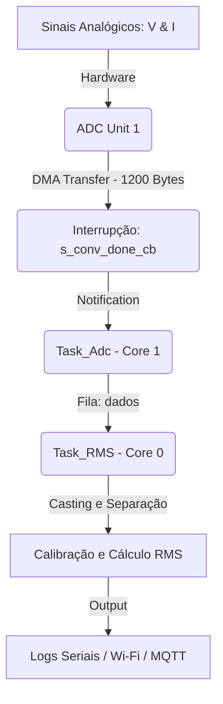

# ESP32 Continuous ADC & Real-Time RMS Monitor

Este repositório contém o firmware de alta performance desenvolvido para o monitoramento simultâneo de sinais analógicos de tensão e corrente trifásica utilizando o SoC **ESP32**. O sistema realiza a aquisição de dados em altíssima velocidade através do modo **ADC Contínuo controlado por DMA (Direct Memory Access)** e calcula os valores **RMS (Root Mean Square)** em tempo real, utilizando uma arquitetura multicore otimizada sob o sistema operativo **FreeRTOS**.

---

## 🚀 Principais Funcionalidades

* **Amostragem de Alta Frequência via DMA:** Configurado para uma taxa global de **36 kHz**, o que garante **6.000 amostras por segundo** para cada um dos 6 canais mapeados. A transferência por DMA evita o bloqueio de CPU durante as leituras.
* **Calibração Avançada de Hardware:** Integração nativa com os esquemas de calibração do ESP-IDF (`Curve Fitting` e `Line Fitting`). Isto converte os dados brutos de 12 bits (`0-4095`) em valores reais de tensão em milivolts ($mV$), corrigindo as não-linearidades intrínsecas do silício do ESP32.
* **Processamento Distribuído (Multicore):** * **Core 1:** Dedicado exclusivamente à captura dos pacotes de dados via interrupções e alimentação de filas de buffers (`Task_Adc`).
* **Core 0:** Focado no processamento matemático pesado, filtragem, calibração, cálculo de RMS em blocos e comunicação (`Task_RMS`).


* **Segurança e Integridade contra Overflow:** Implementação de callbacks em memória RAM rápida (`IRAM_ATTR`) para tratamento de interrupções de hardware. Monitoramento ativo do *pool* do ADC para alertar em caso de perda de pacotes (*frame overflow*).
* **Pronto para IoT:** Estrutura modular preparada para integração nativa com conectividade **Wi-Fi** e protocolo de comunicação **MQTT**.

---

## 📌 Mapeamento de Hardware (Canais e GPIOs)

As leituras são feitas estritamente através da unidade interna `ADC_UNIT_1`. Para garantir o correto alinhamento da memória DMA, os canais são inicializados respeitando a ordem crescente dos registradores internos e leem 2 bytes por amostra.

| Grandeza Monitorada | Variável de Estrutura | Canal ADC | GPIO (ESP32) |
| --- | --- | --- | --- |
| **Corrente - Fase 1** | `dados_corrente1` | `ADC_CHANNEL_0` | GPIO 36 (VP) |
| **Tensão - Fase 1** | `dados_tensao1` | `ADC_CHANNEL_3` | GPIO 39 (VN) |
| **Corrente - Fase 2** | `dados_corrente2` | `ADC_CHANNEL_4` | GPIO 32 |
| **Tensão - Fase 2** | `dados_tensao2` | `ADC_CHANNEL_5` | GPIO 33 |
| **Corrente - Fase 3** | `dados_corrente3` | `ADC_CHANNEL_6` | GPIO 34 |
| **Tensão - Fase 3** | `dados_tensao3` | `ADC_CHANNEL_7` | GPIO 35 |

> ⚠️ **Nota Importante de Hardware:** Os sinais analógicos provenientes dos transformadores de corrente (TCs) e de potencial (TPs) devem passar por circuitos de condicionamento (ex: divisores de tensão e circuitos de offset) para limitar a amplitude máxima do sinal de entrada em **~3.3V**, em conformidade com a atenuação de 2.5dB (`ADC_ATTEN_DB_2_5`) configurada no firmware.

---

## 🛠️ Arquitetura de Software e Fluxo de Dados

O projeto segue uma abordagem modular dividida em componentes organizados dentro da estrutura padrão do framework ESP-IDF:



### Detalhes dos Componentes:

1. **`ADC`**: Gerencia a inicialização do driver contínuo, configurações de tamanho do buffer de amostragem (`1200 bytes` por frame, que representam 100 amostras acumuladas por canal), atenuação de ganho e rotinas de calibração por hardware.
2. **`RTOS`**: Orquestra o ciclo de vida das tarefas e sincronização de eventos. Contém as funções de callback de interrupção (`s_conv_done_cb` e `s_pool_ovf_cb`) e as tarefas de processamento concorrente.
3. **`wifi` & `MQTT_lib**`: Módulos responsáveis pela infraestrutura de comunicação sem fios do dispositivo.
4. **`FUNCTIONS`**: Biblioteca de funções utilitárias para processamento de sinais e suporte matemático.

---

## 💻 Configuração, Compilação e Instalação

### Pré-requisitos

* Placa de desenvolvimento ESP32 (ESP32-WROOM-32, ESP32-DevKitC ou similar).
* **ESP-IDF v5.0 ou superior** instalado e configurado no seu ambiente (utiliza as novas APIs contínuas de `esp_adc/adc_continuous.h`).

### Passo a Passo

1. Abra o terminal na pasta do projeto.
2. Defina o alvo de compilação para o ESP32 padrão:
```bash
idf.py set-target esp32

```


3. Abra o menu de configuração para ajustar parâmetros de rede (Wi-Fi/MQTT) ou opções do compilador se necessário:
```bash
idf.py menuconfig

```


4. Compile o código:
```bash
idf.py build

```


5. Realize o upload (*flash*) do firmware para a placa e abra o monitor serial para acompanhar os cálculos (substitua `PORTA` pela sua porta de comunicação serial, ex: `COM3` ou `/dev/ttyUSB0`):
```bash
idf.py -p PORTA flash monitor

```


*(Para sair do monitor serial do ESP-IDF, utilize o atalho `Ctrl + ]`)*

---

## 📄 Licença

Este projeto está sob a licença **MIT**. Veja o arquivo [LICENSE](https://www.google.com/search?q=LICENSE) para mais detalhes.

---

*Projeto desenvolvido como parte de Trabalho de Conclusão de Curso (TCC) focado em Sistemas Embarcados de Alta Performance, IoT e Monitoramento de Energia.*

---


Desenvolvido usando ESP-IDF com FreeRTOS, este exemplo é ideal para aplicações que necessitam de leituras rápidas e contínuas de sinais analógicos, como monitoramento de sensores analógicos ou aquisição de dados para processamento em tempo real.

